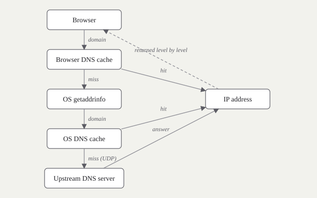
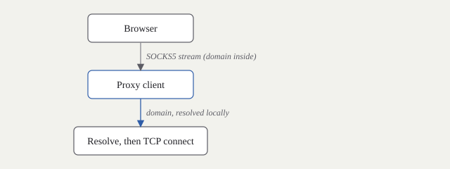
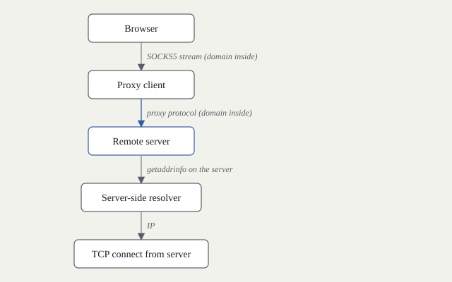
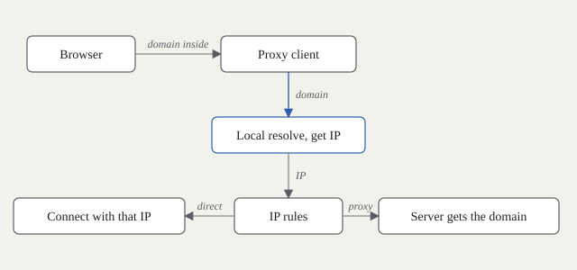
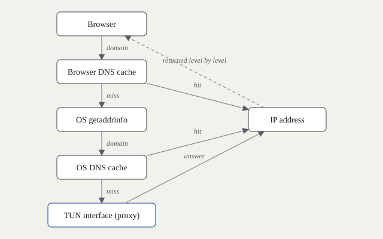
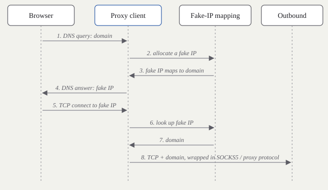

> 中文标题：代理环境下的 DNS 解析。本文为中英双语，中文为原文，英文版本由 AI 翻译，见分隔线之后。
> An English version, translated from the Chinese original with AI
> assistance, follows after the divider.

这是 Sukka 那篇讲代理环境下 DNS 解析的博客的阅读笔记。他写得非常全面，读完之后很多困扰我多年的代理相关问题都有了新的理解。linux.do 上有一篇帖子做过搬运和分析，写得比较简洁；这篇笔记走得慢一些，并配上图。本来想在此基础上进一步结合 mihomo 的 DNS 配置分析一下，这次先放下，另写一篇。

全文以浏览器作为示例应用，依次讨论：

1. 完全不用代理时的 DNS 解析
2. 为应用设置 SOCKS5 代理且仅直连的情况（应用自己的代理设置，以及操作系统的系统代理设置，行为都属于这一类）
3. 增加一个远程服务器
4. 分流规则，按域名和按 IP
5. TUN 模式与系统代理的区别
6. TUN、VPN、代理这几个词
7. 全局模式与全局代理
8. Fake IP
9. 几个边界情况

## 1. 不使用代理

1. 浏览器先在自己的 DNS 缓存里查这个域名，命中就直接用。
2. 未命中则通过 `getaddrinfo` 向操作系统询问。
3. 操作系统查自己的缓存，命中则返回。
4. 未命中则向网络设置中的上游 DNS 服务器发送一个 UDP 查询。
5. 浏览器用得到的 IP 建立 HTTPS 连接。

图中的"IP address"节点抽象了各阶段获得 IP 的过程。这些机制其实并不相同，而且结果是逐级返回、以便每一级都能缓存的；图把这一点压扁了。

## 2. 设置代理并直连

给浏览器设置一个 SOCKS5 代理，但这个代理不连任何远程服务器，只做直连。

1. 因为设置了代理，浏览器不再查自己的 DNS 缓存，也不再向操作系统发查询，而是把域名封装进 SOCKS5 流量发给代理客户端。
2. 代理客户端从流量中取出域名并解析。
3. 代理客户端把 SOCKS5 流量还原成到该 IP 的普通 TCP 连接。

不用代理时，很难影响浏览器的解析过程，因为浏览器直接通过 `getaddrinfo` 和操作系统交互；要改就得改系统解析器，或者自己架一个上游 DNS。有了代理，代理客户端就站在解析路径上，可以影响结果。

## 3. 把流量转发到远程服务器

1. 和前面一样，浏览器把带域名的流量交给代理客户端。
2. 代理客户端用某种代理协议把流量转发给远程服务器。
3. 服务器在自己那一侧解析域名，通过 `getaddrinfo` 或别的方法，然后从那里建立连接。

本机完全没有做 DNS 解析。本地解析可能出的所有问题，比如解析器被污染或不可靠，都被绕开了。

## 4. 分流规则

显然不希望所有流量都走服务器：本地站点和局域网地址应当直连。代理客户端的规则逐连接决定走向。规则有两类，按域名和按 IP。

**域名规则。**

1. 代理客户端把域名和域名规则逐条比较，一般从上到下。
2. 比较结果决定该连接是否走代理。
3. 走代理：同第 3 节，带域名的流量发给服务器，由服务器解析。
4. 直连：同第 2 节，代理客户端本地解析后建立连接。

**IP 规则。**

1. 要匹配 IP 规则，代理客户端必须先在本地解析域名。
2. 把解析到的 IP 和 IP 规则比较。
3. 走代理：发给服务器的流量仍然带域名，而不是本地解析到的 IP。服务器会再解析一次，用它自己的结果。
4. 直连：使用本地解析到的 IP。

所以一条 IP 规则会强制一次本地解析。本地解析的 IP 只在判定为直连时才会被使用，否则会被丢弃。

顺序很重要。如果 IP 规则排在域名规则前面，代理客户端会先碰到它们，在域名规则有机会匹配之前就把每个域名都在本地解析一遍。按照 Sukka 的做法，我把 IP 规则放在最后。引用他介绍自己 Surge 配置的那篇文章：

> 避免 DNS 污染和 DNS 泄漏最有效的办法就是永远不在本地进行 DNS 解析，而 Surge 和 Clash 能且只能通过 Fake IP 和域名规则匹配的方式，可以实现非直连域名一定不在本地本机进行任何 DNS 解析。在 Surge 和 Clash 中，规则自上而下匹配，只有当遇到 IP 类规则（如 IP-CIDR、IP-CIDR6、GEOIP 和 IP-ASN）时才会发起 DNS 解析。因此，将会触发 DNS 解析的规则放在域名和 URL 匹配规则后面非常重要。

## 5. TUN 模式与系统代理

系统代理是操作系统原生支持的：在网络设置里指定代理服务器，所有遵循系统网络配置的应用都会受影响。它更像行业内的一种约定而不是强制，某个程序是否遵守取决于开发者，而且不能承载 UDP 流量。

TUN 模式下，代理客户端创建一个虚拟网卡，并配置操作系统的路由，把所有流量都导入这块网卡；客户端再从网卡读出这些数据包并处理。应用感知不到 TUN 的存在。几乎所有流量都会被拦截，所以一般推荐 TUN 模式。

mihomo 内核提供三种 TUN 协议栈：

- `system`：由操作系统内核的网络栈创建 TCP 连接。效率最高、开销最低；兼容性取决于操作系统。
- `gvisor`：来自 gVisor 项目的用户态网络栈。兼容性最好，能在最多的环境中运行，因为运行在用户空间所以更慢。
- `mixed`：TCP 用 `system`，UDP 用 `gvisor`。折中方案，实现更复杂。

效率上 `system` > `mixed` > `gvisor`，按这个顺序尝试，选第一个能用的即可。例如在 iOS 上，sing-box 的 tunnel 模式选 system 栈无法启动，换 gVisor 就正常；这是兼容性差异，不是 bug。

## 6. TUN、VPN、代理

**TUN 是一种技术**：一个虚拟网络设备，在用户态软件和内核网络栈之间搭桥，让软件读写 IP 数据包。人们也常把这个设备本身叫作"一个 TUN"。TAP 是同一思路低一层的版本：TUN 工作在第三层处理 IP 包，TAP 工作在第二层处理以太网帧。

**VPN** 是在公共网络上建立安全连接的方法。它可以使用专线，也可以在现有网络上用隧道协议，后者在实践中通常就是 TUN 或 TAP 设备，因为专线太贵。

VPN 和代理远看很像。两者都需要一个服务器，都把流量发给它，再由它转发。区别在于侧重点。VPN 为安全和隐私而生：整条链路在协商出的密钥或证书下加密。代理协议（Shadowsocks、VMess、VLESS、Trojan、TUIC 等）侧重逐连接的路由、速度和灵活性；它们大多也会加密，通常基于 TLS。如果目的只是把流量经由远程服务器转发，两者都能做到；两类工具的差别在于侧重，而不在于能做什么。

## 7. 全局模式与全局代理

这两个概念没有关系，但容易混淆。

**全局模式**是一种分流策略，与规则模式、直连模式并列：所有流量走代理、所有流量不走代理，或由规则决定。

**全局代理**与应用级代理相对：代理客户端接管整台机器的全部流量，不需要为每个应用单独设置。应用不知道代理存在，会正常发起 TCP 连接，这意味着与第 2、3 节不同，浏览器仍然会查自己的 DNS 缓存，并等到 DNS 应答之后才建立连接。

与第 1 节相比，唯一的变化是上游 DNS 服务器换成了 TUN 网卡。操作系统发出的每个 DNS 查询都会被代理客户端捕获，按规则规定的方式解析，然后把结果交还给操作系统，再交给浏览器。浏览器随后向该 IP 建立 TCP 连接，这个连接同样会被代理客户端捕获。由于代理客户端刚刚做过这次 DNS 查询，它能把这个只带目标 IP 的连接映射回原来的域名，然后按第 3、4 节继续处理。

## 8. Fake IP

这个词可以追溯到 RFC 3089，一种基于 SOCKS 的 IPv6/IPv4 网关：它把一个"fake IP"交给被 socks 化的应用作为占位目标地址，并维护一张从假地址到真实名字的表。在代理客户端里，Fake IP 是一种让 TCP 连接进入类 SOCKS 处理、同时少做一次 DNS 解析的办法。

把第 2 节和第 7 节对比一下。应用级 SOCKS5 代理下，浏览器直接把域名放进 SOCKS5 流量，代理客户端不解析任何东西就能把流量送到服务器。TUN 下，浏览器是一个普通应用：先发 DNS 查询，等应答，然后才连接。代理客户端需要这次查询才能知道连接背后的域名。所以 TUN 比 SOCKS5 多一次解析。

Fake IP 把这次解析省掉。

1. 跳过第 1 节里的缓存和操作系统阶段，假设查询已经到达代理客户端。
2. 代理客户端从 Fake IP 池中取一个空闲地址，记录假 IP 到域名的映射。
3. 把假 IP 作为 DNS 应答返回。
4. 浏览器向假 IP 建立连接。
5. 代理客户端捕获该连接，读出其中的假 IP。
6. 查表得到域名。
7. 手里有了域名和 TCP 流量，就用 SOCKS5 或服务器支持的协议封装，与第 2 节完全一样。

代理客户端什么都没有解析；它用一个假地址应答，之后再从地址恢复出域名。连接随后被当作浏览器一开始就在说 SOCKS5 来处理。

## 9. 几个边界情况

**缓存了真实 IP。** Fake IP 模式下，假设浏览器自己的缓存里有一个启用 Fake IP 之前得到的真实 IP。它会直接向这个 IP 连接，代理客户端看不到域名，只能走 IP 规则。现代客户端用 sniffer 缓解这个问题：从连接最初的字节里读出 HTTP Host 或 TLS SNI，恢复出域名；mihomo 的 sniffer 支持 HTTP、TLS 和 QUIC。

**缓存了假 IP。** 如果缓存里是假 IP，浏览器向它连接，代理客户端找到映射，之后按第 8 节进行。

**访问不存在的域名。** 浏览器发出 DNS 查询；代理客户端不解析，直接返回一个假 IP。浏览器向假 IP 连接；代理客户端把它映射回那个不存在的域名，然后匹配规则。走代理：域名和流量发给服务器，服务器连不上。直连：代理客户端尝试解析，连不上。两种情况下浏览器都看不到 DNS 错误，因为 DNS 查询是成功的，所以页面会一直处于加载状态。

**缓存了假 IP，但映射丢了。** 代理客户端重启后丢了映射表；浏览器仍缓存着假 IP并向它连接。代理客户端收到一个无法映射的地址，会把它当作真实 IP 处理。大多数 Fake IP 池在 198.18.0.0/15 内，这是 RFC 2544 为网络设备基准测试保留的地址块（mihomo 默认 198.18.0.1/16），所以在普通网络里向这样的地址真实建连通常会失败。

参考文献见下文英文部分。

---

## English version

These are reading notes on Sukka's post about DNS under proxies, which cleared
up several things I had been confused about for years. A thread on linux.do
carries a condensed version; this note goes slower and adds diagrams. I had
meant to follow it with a look at how mihomo's DNS settings map onto the same
picture, but that will have to be a separate note.

Throughout, the example application is a browser. The sections walk through:

1. DNS resolution with no proxy at all
2. An app-level SOCKS5 proxy in direct mode (an application's own proxy
   setting, and the OS system proxy setting, behave this way)
3. Adding a remote server
4. Routing rules, by domain and by IP
5. TUN mode versus the system proxy
6. TUN, VPN, and proxy as words
7. Global mode versus global proxy
8. Fake IP
9. A few edge cases

## 1. No proxy

1. The browser looks up the domain in its own DNS cache. A hit is used
   directly.
2. On a miss it asks the OS through `getaddrinfo`.
3. The OS checks its own cache and returns on a hit.
4. On a miss the OS sends a UDP query to the upstream DNS server configured in
   the network settings.
5. The browser opens an HTTPS connection to the returned IP.

The "IP address" box stands in for whatever produces an address at each
stage. Those mechanisms differ, and the answer is passed back one level at a
time so each level can cache it; the diagram flattens that.

## 2. A proxy in direct mode

Give the browser a SOCKS5 proxy that talks to no remote server, only
"direct".

1. Because a proxy is configured, the browser no longer consults its DNS cache
   or asks the OS. It wraps the domain into the SOCKS5 stream and sends it to
   the proxy client.
2. The proxy client extracts the domain and resolves it.
3. The proxy client turns the SOCKS5 stream back into an ordinary TCP
   connection to that IP.

Without a proxy it is hard to influence how the browser resolves names, since
the browser goes straight to the OS through `getaddrinfo`; you would have to
change the system resolver or run your own upstream DNS. With a proxy, the
proxy client sits in the resolution path and can shape the result.

## 3. Forwarding to a remote server

1. As before, the browser hands the proxy client a stream that carries the
   domain.
2. The proxy client forwards that stream to the remote server using some
   proxy protocol.
3. The server resolves the domain on its own side, through `getaddrinfo` or
   anything else, and connects from there.

No DNS resolution happens on the local machine at all. Problems with local
resolution, such as a polluted or unreliable resolver, are avoided.

## 4. Routing rules

Not everything should go through the server: local sites and LAN addresses
should go direct. The proxy client's rules decide per connection. Two kinds of
rule exist, by domain and by IP.

**Domain rules.**

1. The proxy client compares the domain against the domain rules, usually top
   to bottom.
2. The match decides whether the connection is proxied.
3. Proxied: as in section 3, the stream, domain included, goes to the server,
   which resolves it.
4. Direct: as in section 2, the proxy client resolves locally and connects.

**IP rules.**

1. To match an IP rule at all, the proxy client first has to resolve the
   domain, locally.
2. It compares the resolved IP against the IP rules.
3. Proxied: the stream sent to the server still carries the domain, not the
   locally resolved IP. The server resolves again, and its answer is the one
   used.
4. Direct: the locally resolved IP is used.

So an IP rule forces one local resolution. The locally resolved IP is only
ever used when the verdict is direct; otherwise it is discarded.

Ordering matters. If IP rules sit above domain rules, the proxy client hits
them first and resolves every domain locally before a domain rule can match.
Following Sukka's setup, I put IP rules last. From his post on his own Surge
configuration (my translation):

> The most effective way to avoid DNS pollution and DNS leaks is to never
> resolve DNS locally. Surge and Clash can guarantee that non-direct domains
> are never resolved on the local machine, and only through Fake IP plus
> domain-rule matching. Rules are matched top to bottom, and a DNS resolution
> is triggered only when an IP-type rule (IP-CIDR, IP-CIDR6, GEOIP, IP-ASN) is
> reached. Placing the rules that trigger resolution after the domain and URL
> rules is therefore important.

## 5. TUN mode versus the system proxy

The system proxy is something the OS supports out of the box: set a proxy
server in the network settings and every application that honors the system
configuration follows it. It is a convention, not an enforcement. Whether a
given program honors it depends on its developer, and it does not carry UDP.

In TUN mode the proxy client creates a virtual network interface and
configures the OS routing table so that all traffic goes into it; the client
then reads the packets back out and handles them. Applications cannot tell
that TUN is in use. Almost all traffic is intercepted, which is why TUN mode
is usually the recommendation.

The mihomo kernel offers three TUN stacks:

- `system`: TCP connections are created by the kernel's own network stack.
  Highest efficiency, lowest overhead; compatibility depends on the OS.
- `gvisor`: a userspace network stack taken from the gVisor project. Best
  compatibility, works in the most environments, slower because it runs in
  user space.
- `mixed`: `system` for TCP and `gvisor` for UDP. A balance, with more moving
  parts.

Efficiency goes `system` > `mixed` > `gvisor`, so try them in that order and
stop at the first one that works. On iOS, for instance, sing-box's tunnel mode
will not start with the system stack but runs fine with gVisor; that is a
compatibility difference, not a bug.

## 6. TUN, VPN, proxy

**TUN is a technique**: a virtual network device that bridges userspace
software and the kernel network stack, letting the software read and write IP
packets. People also call the device itself "a TUN". TAP is the same idea one
layer down: TUN works at layer 3 with IP packets, TAP at layer 2 with Ethernet
frames.

**A VPN** builds a secure connection across a public network. It can use a
dedicated line or a tunneling protocol over an existing network, which in
practice usually means a TUN or TAP device, because dedicated lines are
expensive.

A VPN and a proxy look alike from a distance. Both need a server; both send
your traffic to it; the server forwards it on. The difference is emphasis. A
VPN is built for security and privacy: the whole link is encrypted under a
negotiated key or certificate. Proxy protocols (Shadowsocks, VMess, VLESS,
Trojan, TUIC, and so on) focus on per-connection routing, speed, and
flexibility; most of them also encrypt, typically with TLS. If the aim is
simply to route traffic through a remote server, either works. The two
categories differ in emphasis rather than in what they can do.

## 7. Global mode versus global proxy

These two are unrelated, but easy to confuse.

**Global mode** is a routing policy, next to rule mode and direct mode:
everything is proxied, nothing is proxied, or the rules decide.

**Global proxy** is the opposite of an app-level proxy: the proxy client takes
over all of the machine's traffic without each application being configured.
Applications do not know a proxy exists. They open TCP connections normally,
which means that, unlike sections 2 and 3, the browser still consults its own
DNS cache and waits for a DNS answer before connecting.

Compared with section 1, the only change is that the upstream DNS server has
been replaced by the TUN interface. Every DNS query the OS sends is captured
by the proxy client, resolved in whatever way the rules dictate, and the
answer is handed back to the OS and then to the browser. The browser then
opens a TCP connection to that IP, which the proxy client also captures.
Because the proxy client performed the DNS lookup a moment earlier, it can map
the connection's bare destination IP back to the domain it came from, and
continue as in sections 3 and 4.

## 8. Fake IP

The term goes back to RFC 3089, a SOCKS-based IPv6/IPv4 gateway, which hands a
"fake IP" to a socksified application as a placeholder destination and keeps a
table from fake address to real name. In proxy clients, Fake IP is a way of
getting a TCP connection into SOCKS-like handling with one DNS resolution
fewer.

Compare section 2 with section 7. With an app-level SOCKS5 proxy, the browser
puts the domain straight into the SOCKS5 stream, so the proxy client can ship
the stream to the server without resolving anything. Under TUN, the browser is
a normal application: it sends a DNS query, waits for an answer, and only then
connects. The proxy client needs that query to learn the domain behind the
connection. So TUN costs one extra resolution compared with SOCKS5.

Fake IP removes it.

1. Skip the cache and OS stages from section 1; assume the query has reached
   the proxy client.
2. The proxy client takes a free address from its Fake IP pool and records the
   mapping from fake IP to domain.
3. It returns the fake IP as the DNS answer.
4. The browser connects to the fake IP.
5. The proxy client captures that connection and reads the fake IP off it.
6. It looks the fake IP up and gets the domain back.
7. With the domain and the TCP stream in hand, it wraps them in SOCKS5 or
   whatever protocol the server speaks, exactly as in section 2.

The proxy client resolved nothing; it answered with a fake address and later
recovered the domain from the address. The connection is then handled as if
the browser had spoken SOCKS5 in the first place.

## 9. Some edge cases

**A cached real IP.** Under Fake IP, suppose the browser's own cache holds a
real IP from before Fake IP was enabled. It connects to that IP directly, the
proxy client never sees a domain, and only IP rules can apply. Modern clients
mitigate this with a sniffer that reads the HTTP Host header or the TLS SNI
out of the first bytes of the connection and recovers the domain; mihomo's
sniffer does this for HTTP, TLS, and QUIC.

**A cached fake IP.** If the cache holds a fake IP, the browser connects to
it, the proxy client finds the mapping, and everything proceeds as in
section 8.

**A domain that does not exist.** The browser sends a DNS query; the proxy
client does not resolve it and returns a fake IP. The browser connects to the
fake IP; the proxy client maps it back to the nonexistent domain and applies
the rules. Proxied: the domain and stream go to the server, which cannot
connect. Direct: the proxy client tries to resolve and cannot connect. In both
cases the browser sees no DNS error, because the DNS query succeeded, so it
shows a page that loads forever.

**A cached fake IP whose mapping is gone.** The proxy client restarted and
lost its table; the browser still has the fake IP cached and connects to it.
The proxy client receives a connection to an address it cannot map and treats
it as a real IP. Most Fake IP pools live in 198.18.0.0/15, the block RFC 2544
reserves for benchmarking network equipment (mihomo defaults to
198.18.0.1/16), so a real connection to such an address fails in an ordinary
network.

## References

1. Sukka, [What happens to DNS under a proxy](https://blog.skk.moe/post/what-happend-to-dns-in-proxy/) (in Chinese), the post these notes follow.
2. Sukka, [My Surge setup](https://blog.skk.moe/post/i-have-my-unique-surge-setup) (in Chinese), the source of the rule-ordering quote.
3. linux.do, [DNS resolution under a proxy](https://linux.do/t/topic/406471) (in Chinese), a condensed retelling.
4. mihomo wiki: [TUN](https://wiki.metacubex.one/config/inbound/tun/), [DNS](https://wiki.metacubex.one/config/dns/), and [Sniffer](https://wiki.metacubex.one/config/sniff/).
5. [RFC 3089: A SOCKS-based IPv6/IPv4 Gateway Mechanism](https://www.rfc-editor.org/rfc/rfc3089).
6. [RFC 2544: Benchmarking Methodology for Network Interconnect Devices](https://www.rfc-editor.org/rfc/rfc2544).
7. Wikipedia, [TUN/TAP](https://en.wikipedia.org/wiki/TUN/TAP) and [Virtual private network](https://en.wikipedia.org/wiki/Virtual_private_network).
