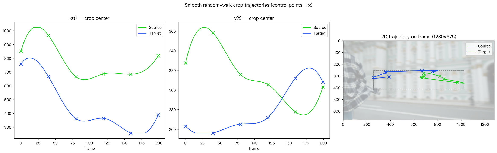
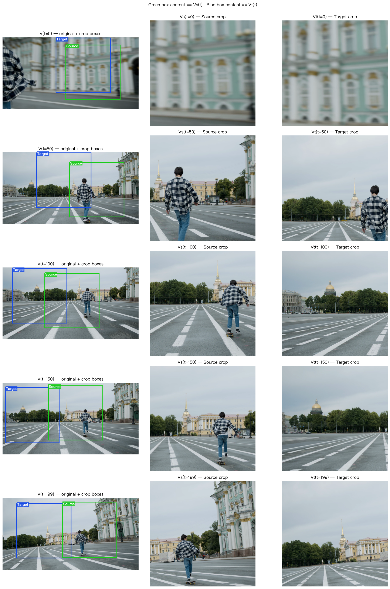
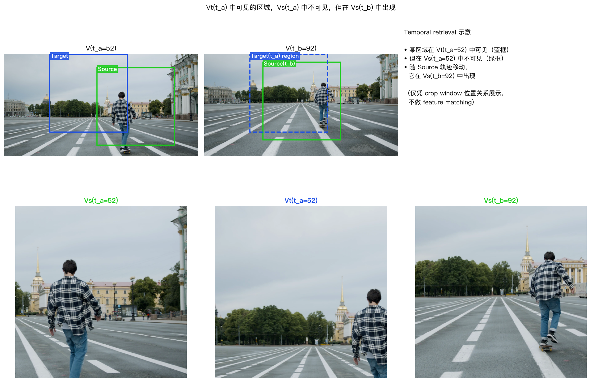

> 中文标题：单目视频自监督伪多视角构造。本文为中英双语，中文为原文，英文版本由 AI 翻译，见分隔线之后。
> An English version, translated from the Chinese original with AI
> assistance, follows after the divider.

_Reshoot-Anything_（Paliwal 等，2026）的阅读笔记。让我感兴趣的机制是：从单个视频构造同步的伪 source 视角、伪 target 视角，以及一个刻意带失真的 anchor。模型不能逐帧复制 source，只能从 source 序列的其他时刻检索纹理并重投影，才能重建 target。

## 问题

给定单目视频 $V(t)$，目标是在另一条相机轨迹下生成同一场景的 $V_t(t)$。真实的同步多目动态视频很少，所以没有大规模的 $(V_s, V_t)$ 形式的监督。论文的答案是仅由单目视频构造训练三元组 $(V_s, V_a, V_t)$。这是二维伪多视角自监督，不等同于恢复真实相机位姿或做显式的 4D 重建。

## 1. 两条独立的平滑 crop 轨迹

在同一个视频 $V$ 内采样两条独立轨迹 $C_s(t)$ 与 $C_t(t)$，并沿轨迹裁剪：

$$
V_s(t) = \operatorname{Crop}(V(t), C_s(t)), \qquad V_t(t) = \operatorname{Crop}(V(t), C_t(t)).
$$

每条轨迹在画面内采样随机控制点，用自然三次样条连成连续的 crop 中心路径；两条轨迹使用不同的随机种子。它们在时间上连续，模拟的是平滑的二维视窗或相机运动，而不是每帧独立的随机裁剪。原视频本来就有的平移、绕行或缩放会被两条伪视角共同继承。

关键在于 $V_s(t)$ 与 $V_t(t)$ 在构造上就是空间不对齐的，而且 crop 边界会制造人工遮挡和缺失区域。因此 $V_s(t)$ 不能作为 $V_t(t)$ 的逐帧拷贝。但 crop 本身只是二维关系，它本身不能说明目标像素应该落在哪里。

## 2. 用前向 warp 构造 anchor

论文先在裁剪前的原视频上计算稠密 2D tracking field，再与 source、target 两个 crop 之间的 offset flow 合成 $F_{\mathrm{comb}}(t)$。从 source 的参考帧 $V_s(r)$ 出发，anchor 为

$$
V_a(t) = \operatorname{SoftSplat}\bigl(V_s(r), F_{\mathrm{comb}}(t)\bigr).
$$

默认 $r = 0$；作为增强，训练时随机选择参考帧，避免模型只依赖首帧。前向 warp 天然会产生孔洞、遮挡和扭曲，这是刻意模拟推理时从 4D 点云投影得到的低质量 anchor。

anchor 的职责是给出目标的布局和几何提示，而不是高保真纹理。内容的干净证据仍然来自完整的 source 序列 $V_s$。因此条件是 $(V_s, V_a)$，监督目标是 $V_t$。

## 3. 自监督信号为何成立

在某个时刻 $t_a$，目标 crop 中可见的区域可能不在同一时刻的 source crop 中，却出现在另一个时刻的 $V_s(t_b)$ 里。要重建 $V_t(t_a)$，模型必须同时：

1. 把 $V_a$ 当作有失真的目标布局提示，而不是直接复制它的纹理。
2. 在 source 的空间和时间维度中检索干净、可见的纹理。
3. 把这些纹理放回与 $V_a$ 一致的目标位置，并与目标时刻的动态状态同步。

这种"擦除当前帧信息、跨时刻检索、重投影到目标位置"的压力，就是论文所说的隐式 4D 时空学习。训练目标直接监督 $V_t$ 的重建，没有单独的显式 4D 重建损失。

## 4. 在真实帧上核对机制

我重新实现了 crop 采样器，检查了三件事。

轨迹图显示 source 与 target 的 crop 中心路径连续且彼此独立，并标出了样条控制点。

裁剪示例展示了同一原视频帧中两条窗口分别生成 $V_s(t)$ 与 $V_t(t)$，且空间错位随时间增大。

temporal-retrieval 图直接展示了训练压力：某区域在 $V_t(t_a)$ 中可见、在 $V_s(t_a)$ 中不可见、但在 $V_s(t_b)$ 中重新出现。这张图只验证 crop 窗口的可见性关系，不是 tracker、feature matching、warp 质量或训练后模型检索效果的实测结果。

图中的视频帧来自 Pexels 素材视频 4935705，按 Pexels 许可使用。

## 5. 机制的边界

1. 两条平滑 crop 提供的只是伪视角差异，不产生真实视差、相对位姿或度量深度监督。
2. anchor 的质量取决于稠密 2D tracking 和前向 warp。它应该包含推理时会出现的失真，而不应被当作干净的 ground truth。
3. 如果目标区域从未在任何 source 帧中可见，模型只能靠生成先验补全。跨时刻检索不能保证恢复这类信息。
4. 这个机制说明了如何从单目视频构造自监督信号。它本身并不说明该信号能迁移到其他模型、相机模型或数据域。

参考文献见下文英文部分。

---

## English version

Reading notes on _Reshoot-Anything_ (Paliwal et al., 2026). The mechanism that
interested me: from a single video, the paper builds a synchronized pseudo
source view, a pseudo target view, and a deliberately distorted anchor. The
model cannot copy the source frame by frame, so it has to retrieve texture
from other times in the source sequence and re-project it to rebuild the
target.

## The problem

Given a monocular video $V(t)$, the goal is to generate $V_t(t)$, the same
scene along a different camera trajectory. Real synchronized multi-camera
dynamic video is rare, so there is no large-scale supervision of the form
$(V_s, V_t)$. The paper's answer is to construct training triplets
$(V_s, V_a, V_t)$ from monocular video alone. It is two-dimensional pseudo
multi-view self-supervision, which is not the same as recovering real camera
poses or performing explicit 4D reconstruction.

## 1. Two independent smooth crop trajectories

Sample two independent trajectories $C_s(t)$ and $C_t(t)$ inside the same
video $V$ and crop along them:

$$
V_s(t) = \operatorname{Crop}(V(t), C_s(t)), \qquad V_t(t) = \operatorname{Crop}(V(t), C_t(t)).
$$

Each trajectory samples random control points inside the frame and joins them
with a natural cubic spline into a continuous crop-center path; the two use
different random seeds. They are continuous in time, so they imitate a smooth
2D window or camera motion rather than an independent random crop per frame.
Any pan, orbit, or zoom already present in the original video is inherited by
both pseudo views.

The point is that $V_s(t)$ and $V_t(t)$ are spatially misaligned by
construction, and the crop borders create artificial occlusion and missing
regions. So $V_s(t)$ cannot serve as a per-frame copy of $V_t(t)$. But a crop
is only a 2D relation; by itself it says nothing about where a target pixel
should land.

## 2. Building the anchor by forward warping

The paper computes a dense 2D tracking field on the uncropped video and
composes it with the offset flow between the source and target crops to get
$F_{\mathrm{comb}}(t)$. Starting from a source reference frame $V_s(r)$, the
anchor is

$$
V_a(t) = \operatorname{SoftSplat}\bigl(V_s(r), F_{\mathrm{comb}}(t)\bigr).
$$

The default is $r = 0$; as augmentation, training picks the reference frame at
random so the model does not learn to depend on the first frame. Forward
warping naturally produces holes, occlusions, and distortion, which
deliberately mimics the low-quality anchor that comes from projecting a 4D
point cloud at inference time.

The anchor's job is to give the target's layout and geometry hint, not
high-fidelity texture. Clean evidence for the content still comes from the
full source sequence $V_s$. So the conditioning is $(V_s, V_a)$ and the
supervised output is $V_t$.

## 3. Why the self-supervision signal holds

At some time $t_a$, a region visible in the target crop may be absent from the
source crop at the same time, yet present in $V_s(t_b)$ at another time
$t_b$. To reconstruct $V_t(t_a)$, the model must simultaneously:

1. Treat $V_a$ as a distorted layout hint for the target rather than copying
   its texture.
2. Search the source across space and time for clean, visible texture.
3. Put that texture back at the target location consistent with $V_a$,
   synchronized with the dynamic state at the target time.

This pressure, erase the current-frame information, retrieve across time,
re-project to the target position, is what the paper calls implicit 4D
spatio-temporal learning. The training objective supervises the
reconstruction of $V_t$ directly; there is no separate explicit 4D
reconstruction loss.

## 4. Checking the mechanism on real frames

I reimplemented the crop sampler and looked at three things.

The trajectory plot shows that the source and target crop-center paths are
continuous and independent, with the spline control points marked.

The crop examples show two windows over the same original frame producing
$V_s(t)$ and $V_t(t)$, with the spatial misalignment growing over time.

The temporal-retrieval figure shows the training pressure directly: a region
visible in $V_t(t_a)$, missing from $V_s(t_a)$, and present again in
$V_s(t_b)$. This figure only exercises the crop-window visibility relation. It
says nothing about the tracker, feature matching, warp quality, or how well a
trained model actually retrieves.

The frames in these figures come from a Pexels stock video (video 4935705),
used under the Pexels license.

## 5. Limits of the mechanism

1. Two smooth crops provide pseudo view differences only. They generate no
   real parallax, relative pose, or metric depth supervision.
2. The anchor is only as good as the dense 2D tracking and the forward warp.
   It should contain the distortions inference will produce, and it should not
   be treated as clean ground truth.
3. If a target region is never visible in any source frame, the model can only
   fill it from a generative prior. Cross-time retrieval cannot guarantee that
   information.
4. The mechanism shows how to build a self-supervision signal from monocular
   video. It does not by itself show that the signal transfers to other
   models, camera models, or data domains.

## References

1. Avinash Paliwal, Adithya Iyer, Shivin Yadav, Muhammad Ali Afridi, and Midhun Harikumar, [Reshoot-Anything: A Self-Supervised Model for In-the-Wild Video Reshooting](https://arxiv.org/abs/2604.21776), 2026.
2. Pexels, [video 4935705](https://www.pexels.com/video/4935705/), the source footage behind the figures.
