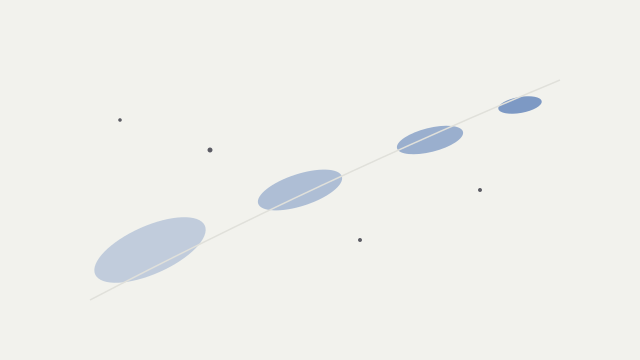

This post exists to validate the writing pipeline end to end. Every element a
real technical note might use appears at least once.

## Inline and display math

The rendering equation integrates incoming radiance over the hemisphere: for a
point $x$ with normal $n$, outgoing radiance $L_o$ depends on the BRDF $f_r$
and incoming radiance $L_i$.

$$
L_o(x, \omega_o) = L_e(x, \omega_o) + \int_{\Omega} f_r(x, \omega_i, \omega_o)\, L_i(x, \omega_i)\, (\omega_i \cdot n)\, d\omega_i
$$

A 3D Gaussian primitive is parameterized by mean $\mu \in \mathbb{R}^3$ and
covariance $\Sigma = R S S^\top R^\top$, and its footprint after projection is

$$
G(x) = \exp\left(-\tfrac{1}{2}(x-\mu)^\top \Sigma^{-1} (x-\mu)\right).
$$

## Code

```python
import numpy as np


def gaussian_footprint(x: np.ndarray, mu: np.ndarray, cov: np.ndarray) -> float:
    """Evaluate an anisotropic Gaussian footprint.

    Args:
        x: Query point, shape (3,).
        mu: Gaussian mean, shape (3,).
        cov: Covariance matrix, shape (3, 3).

    Returns:
        Unnormalized density at x.
    """
    d = x - mu
    return float(np.exp(-0.5 * d @ np.linalg.solve(cov, d)))
```

Inline code like `renderer.setPixelRatio(2)` should sit quietly in the text.

## Figure



## Table

| Representation | Primitives | Render cost |
| -------------- | ---------- | ----------- |
| NeRF           | MLP field  | high        |
| 3DGS           | Gaussians  | low         |
| Mesh           | Triangles  | lowest      |

## Quote and footnote

> The best visual explanations show the structure of the thing itself, not the
> structure of the tool that made it.

Footnotes should render with back-links.[^1]

[^1]: Like this one. It returns you to the text where you left off.
